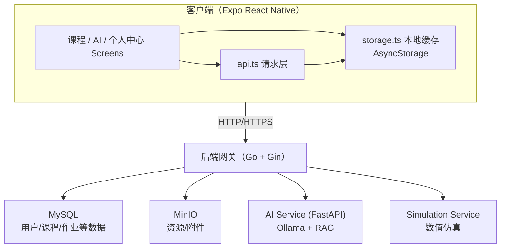

# classPlatform Mobile 产品报告

**项目名称**：classPlatform Mobile  
**开发者**：胡傲东  
**提交日期**：2026年1月23日  
**文档版本**：1.1  
**最后更新**：2026年1月24日  
**适用范围**：移动端 App（iOS / Android / Web）  
**规范依据**：`docs/contributing/项目规范指南.md`  
**GitHub 仓库**：https://github.com/JadeSnow7/graduationDesign

---

## 零、作业要求速览

- **功能要求**：实现并演示至少 1 个功能点（本项目包含：课程学习、作业/测验/资源、AI 助教等）
- **技术要求**：使用网络/存储等技术点至少 1 条（本项目同时使用：HTTP API 调用 + AsyncStorage 本地持久化）
- **性能要求**：不卡顿、无明显资源泄露（通过列表虚拟化渲染、请求取消、定时器/监听器清理、消息上限等手段保证）

## 一、产品功能介绍

### 1.1 产品概述

**classPlatform Mobile** 是一款基于 React Native (Expo) 开发的跨平台 AI 智能辅导应用，支持 iOS、Android 和 Web 三端运行。该应用专注于为学生和教师提供完整的课程管理和智能辅导体验。

### 1.2 核心功能模块

| 功能模块 | 描述 | 用户角色 |
|---------|------|---------|
| **用户认证** | 账户登录、会话持久化 | 所有用户 |
| **课程管理** | 课程列表浏览、课程详情查看 | 学生/教师 |
| **章节学习** | 章节内容阅读、学习时长追踪 | 学生 |
| **AI 智能聊天** | 三种对话模式：导师/解题/模拟 | 学生 |
| **作业管理** | 作业列表、创建作业、提交作业 | 学生/教师 |
| **测验系统** | 测验列表、创建测验 | 学生/教师 |
| **资源管理** | 资源列表、创建资源 | 学生/教师 |
| **个人中心** | 学习统计、缓存管理、退出登录 | 所有用户 |

### 1.3 功能详情

#### 1.3.1 用户认证
- 支持用户名/密码登录
- JWT Token 认证机制
- 登录状态本地持久化（AsyncStorage）
- 自动恢复上次会话

#### 1.3.2 课程管理
- 下拉刷新获取最新课程列表
- 展示课程名称、教师、学生数量
- 课程详情页包含四个 Tab：章节、作业、测验、资源

#### 1.3.3 章节学习
- 章节内容渲染展示
- **学习时长追踪**：每 30 秒自动上报心跳数据
- 离开页面时自动提交最终学习时长

#### 1.3.4 AI 智能聊天
- **导师模式**：苏格拉底式提问，引导学生自主思考
- **解题模式**：直接给出答案和详细解题步骤
- **模拟模式**：通过实验场景解释抽象概念
- 聊天记录本地缓存，支持离线查看

#### 1.3.5 教师功能
- 创建作业（标题、描述、截止日期）
- 创建测验（标题、描述、时间限制）
- 创建资源（视频/文档/链接类型）

---

## 二、程序概要设计

### 2.1 项目目录结构

```
code/mobile/
├── App.tsx                      # 应用入口
├── app.json                     # Expo 配置
├── package.json                 # 依赖配置
└── src/
    ├── api.ts                   # 网络请求层 (15+ 接口)
    ├── config.ts                # 配置常量
    ├── storage.ts               # 本地存储管理
    ├── types.ts                 # TypeScript 类型定义
    ├── navigation/
    │   └── AppNavigator.tsx     # 导航系统
    ├── screens/
    │   ├── LoginScreen.tsx      # 登录页面
    │   ├── CoursesScreen.tsx    # 课程列表
    │   ├── CourseDetailScreen.tsx   # 课程详情 (含 Tabs)
    │   ├── ChapterContentScreen.tsx # 章节学习
    │   ├── ChatScreen.tsx       # AI 聊天
    │   ├── ProfileScreen.tsx    # 个人中心
    │   └── CreateItemScreen.tsx # 创建表单 (教师)
    └── components/
        └── MessageBubble.tsx    # 消息气泡组件
```

### 2.2 核心模块说明

| 模块 | 职责 |
|------|------|
| **App.tsx** | 应用入口，管理全局状态（会话、消息），包装 SafeAreaProvider |
| **AppNavigator.tsx** | 导航系统，实现底部 Tab + Stack 嵌套导航 |
| **api.ts** | 封装 HTTP 请求，处理超时、取消、多种响应格式 |
| **storage.ts** | AsyncStorage 封装，管理会话和消息持久化 |
| **CourseDetailScreen.tsx** | 课程详情，Tab 切换，教师可创建作业/测验/资源 |
| **ChapterContentScreen.tsx** | 章节学习，学习时长心跳上报 |
| **ChatScreen.tsx** | AI 聊天，三种模式切换，消息列表 |

---

## 三、软件架构图

### 3.1 整体架构（Mermaid）



### 3.2 整体架构（ASCII 备份）

```
┌───────────────────────────────────────────────────────────────┐
│                    客户端 (Expo React Native)                   │
├───────────────────────────────────────────────────────────────┤
│  课程/AI/个人中心 Screens                                      │
│  ┌──────────────────────────────────────────────────────────┐  │
│  │ api.ts (网络请求层) + storage.ts (AsyncStorage 缓存)      │  │
│  └──────────────────────────────────────────────────────────┘  │
└───────────────────────────────────────────────────────────────┘
                              │ HTTP/HTTPS
                              ▼
┌───────────────────────────────────────────────────────────────┐
│                    后端网关 (Go + Gin)                          │
├───────────────────────────────────────────────────────────────┤
│  认证 / 课程 / 章节 / 作业 / 测验 / 资源 / AI 路由              │
└───────────────────────────────────────────────────────────────┘
          │              │                │             │
          ▼              ▼                ▼             ▼
   MySQL（结构化数据）  MinIO（资源附件）  AI Service     仿真服务
                         (Ollama + RAG)   (FastAPI)      (FastAPI)
```

### 3.3 导航架构

```
AppNavigator
├── AuthStack (未登录)
│   └── LoginScreen
    └── MainTabs (已登录)
    ├── HomeTab（课程）
    │   └── HomeStack
    │       ├── CoursesScreen
    │       ├── CourseDetailScreen
    │       └── ChapterContentScreen
    ├── ChatTab（AI 助教）
    │   └── ChatScreen
    └── ProfileTab（我的）
        └── ProfileScreen
```

---

## 四、API 设计与说明

### 4.1 基础约定

- **基地址**：开发默认 `http://localhost:8080`，生产环境由配置覆盖（见 `src/config.ts`）。
- **统一前缀**：`/api/v1`
- **认证方式**：登录返回 `access_token` 与 `token_type`，后续请求使用 `Authorization: <token_type> <token>`。
- **响应格式兼容**：客户端同时支持 `{ success, data }`、`{ data }` 与直接返回对象/数组三种格式。
- **错误与超时**：超时 60s 自动中断；主动取消返回 `Request canceled`，超时返回 `Request timed out`。

### 4.2 接口清单（移动端实际使用）

| 模块 | 方法 | 路径 | 说明 | 权限 |
|------|------|------|------|------|
| 认证 | POST | `/auth/login` | 登录获取 token | 公共 |
| AI | POST | `/ai/chat` | 多模式对话（`tutor` / `problem_solver` / `sim_explain`） | 登录 |
| 课程 | GET | `/courses` | 课程列表 | 登录 |
| 课程 | GET | `/courses/{courseId}` | 课程详情 | 登录 |
| 章节 | GET | `/courses/{courseId}/chapters` | 章节列表 | 登录 |
| 章节 | GET | `/chapters/{chapterId}` | 章节内容 | 登录 |
| 章节 | POST | `/chapters/{chapterId}/study-time` | 上报学习时长（`duration_seconds`） | 登录 |
| 作业 | GET | `/courses/{courseId}/assignments` | 作业列表 | 登录 |
| 作业 | GET | `/assignments/{assignmentId}` | 作业详情 | 登录 |
| 作业 | POST | `/assignments/{assignmentId}/submit` | 提交作业（`content`） | 学生 |
| 测验 | GET | `/courses/{courseId}/quizzes` | 测验列表 | 登录 |
| 测验 | GET | `/quizzes/{quizId}` | 测验详情 | 登录 |
| 测验 | POST | `/quizzes/{quizId}/submit` | 提交测验（`answers`） | 学生 |
| 资源 | GET | `/courses/{courseId}/resources` | 资源列表 | 登录 |
| 教师 | POST | `/courses/{courseId}/assignments` | 创建作业 | 教师/管理员 |
| 教师 | POST | `/quizzes` | 创建测验 | 教师/管理员 |
| 教师 | POST | `/resources` | 创建资源（body 含 `course_id`） | 教师/管理员 |
| 统计 | GET | `/users/me/stats` | 学习统计 | 登录 |
| 学生画像 | GET | `/students/{studentId}/global-profile` | 学习画像 | 权限控制 |
| 写作 | POST | `/courses/{courseId}/writing` | 提交写作 | 学生 |
| 写作 | GET | `/courses/{courseId}/writing` | 写作提交列表（支持 `writing_type`） | 登录 |
| 写作 | GET | `/writing/{submissionId}` | 写作详情 | 登录 |

### 4.3 请求/响应示例

#### 登录

```http
POST /api/v1/auth/login
Content-Type: application/json
```

```json
{
  "username": "student1",
  "password": "******"
}
```

```json
{
  "access_token": "jwt-token",
  "token_type": "Bearer",
  "expires_in": 3600,
  "user_id": "1001",
  "username": "student1",
  "role": "student"
}
```

#### AI 对话（导师/解题/模拟）

```http
POST /api/v1/ai/chat
Authorization: Bearer <token>
Content-Type: application/json
```

```json
{
  "mode": "tutor",
  "messages": [
    { "role": "user", "content": "解释一下电场" }
  ],
  "stream": false
}
```

```json
{
  "reply": "..."
}
```

#### 测验提交（多选示例）

```http
POST /api/v1/quizzes/12/submit
Authorization: Bearer <token>
Content-Type: application/json
```

```json
{
  "answers": {
    "3": ["A", "C"],
    "4": "B"
  }
}
```

```json
{
  "score": 85,
  "max_score": 100
}
```

> 其他接口细节参考 `docs/api/README.md` 与后端接口文档。

---

## 五、技术亮点及实现原理

### 5.1 网络请求优化

#### 请求超时与取消机制

```typescript
async function request<T>(path: string, options: RequestInit = {}): Promise<T> {
  const { signal: externalSignal, ...rest } = options;
  const controller = new AbortController();
  const timeoutId = setTimeout(() => controller.abort(), NETWORK_TIMEOUT_MS);
  
  // 支持外部取消信号
  if (externalSignal) {
    if (externalSignal.aborted) controller.abort();
    externalSignal.addEventListener('abort', () => controller.abort(), { once: true });
  }
  
  try {
    const response = await fetch(buildUrl(path), {
      ...rest,
      signal: controller.signal,
      // ...
    });
    // 处理多种响应格式
  } finally {
    clearTimeout(timeoutId);
  }
}
```

**技术亮点**：
- 统一 60 秒超时控制（`NETWORK_TIMEOUT_MS = 60000`，可按需调整）
- 支持外部 AbortController 取消请求
- 兼容三种后端响应格式：`{success, data}`、`{data}`、直接返回

### 5.2 学习时长追踪

#### 心跳上报机制

```typescript
useEffect(() => {
  const sendHeartbeat = async () => {
    const now = Date.now();
    const elapsed = Math.floor((now - lastHeartbeatRef.current) / 1000);
    if (elapsed > 0 && isActiveRef.current) {
      await recordStudyTime(session.token, session.tokenType, chapterId, elapsed);
      setStudySeconds((prev) => prev + elapsed);
      lastHeartbeatRef.current = now;
    }
  };

  const subscription = AppState.addEventListener('change', handleAppStateChange);
  const intervalId = setInterval(sendHeartbeat, 30000); // 每30秒

  return () => {
    subscription.remove();
    clearInterval(intervalId);
    sendHeartbeat(); // 页面卸载时发送最终心跳
  };
}, [chapterId]);
```

**技术亮点**：
- 每 30 秒自动上报学习时长
- 监听 AppState 变化，后台时暂停计时
- 页面离开时发送最终心跳，确保数据不丢失

### 5.3 本地存储持久化

```typescript
// 消息存储限制
export async function saveMessages(messages: ChatMessage[]): Promise<void> {
  const trimmed = messages.slice(-MAX_HISTORY); // 限制最多 50 条
  await AsyncStorage.setItem(STORAGE_KEYS.messages, JSON.stringify(trimmed));
}
```

**技术亮点**：
- 消息数量限制（MAX_HISTORY = 50），防止存储膨胀
- 会话与消息分离存储，便于独立管理
- 应用启动时自动恢复历史数据

### 5.4 竞态条件处理

```typescript
const requestIdRef = useRef(0);
const mountedRef = useRef(true);

const handleSend = async () => {
  const requestId = requestIdRef.current + 1;
  requestIdRef.current = requestId;
  
  // 发送请求...
  
  if (!mountedRef.current || requestId !== requestIdRef.current) {
    return; // 忽略过期响应
  }
  // 更新状态...
};
```

**技术亮点**：
- requestId 追踪确保只处理最新请求的响应
- mountedRef 防止组件卸载后更新状态
- 组件卸载时自动取消进行中的请求

### 5.5 教师角色功能控制

```typescript
const isTeacher = session.user.role === 'teacher' || session.user.role === 'admin';

// 仅教师可见的 FAB 按钮
{isTeacher && activeTab !== 'chapters' && (
  <Pressable style={styles.fab} onPress={() => setShowCreateModal(true)}>
    <Text style={styles.fabText}>+</Text>
  </Pressable>
)}
```

**技术亮点**：
- 基于用户角色动态显示/隐藏功能
- Modal 表单支持创建作业、测验、资源

---

## 六、技术栈总结

| 类别 | 技术选型 |
|------|----------|
| **框架** | React Native (Expo SDK 54) |
| **语言** | TypeScript |
| **导航** | React Navigation 7.x |
| **状态管理** | React Hooks (useState, useEffect, useRef) |
| **网络请求** | Fetch API + AbortController |
| **本地存储** | @react-native-async-storage/async-storage |
| **UI 组件** | React Native 原生组件 + Modal |
| **后端** | Go + Gin + MySQL |
| **AI 服务** | Ollama（本地推理）+ AI Service（ai_service）+ 可选 GraphRAG |

---

## 七、作业要求对照

| 要求项 | 实现情况 | 说明 |
|--------|----------|------|
| 功能要求 | 已满足 | AI 智能聊天 + 课程管理 + 作业/测验/资源创建 |
| 技术要求（网络） | 已满足 | HTTP API 调用（15+ 接口）|
| 技术要求（存储） | 已满足 | AsyncStorage 本地持久化 |
| 性能要求 | 已满足 | FlatList 虚拟化、请求取消、心跳优化 |

---

## 八、运行与演示说明

### 8.1 运行依赖

- Node.js + npm、Expo SDK 54
- macOS + Xcode（iOS 模拟器/真机）
- 后端与依赖：Docker（`code/docker-compose.yml`）
- 本地大模型：Ollama（默认监听 `127.0.0.1:11434`，供 AI Service 调用）

### 8.2 启动方式（开发/演示）

```bash
# 1) 启动后端（Go + MySQL + AI Service + MinIO + Simulation）
cd code
docker compose up -d

# 2) 启动 iOS 原生开发构建并运行
cd mobile
npx expo run:ios
```

说明：
- 默认开发环境下 `API_BASE_URL = http://localhost:8080`（iOS 模拟器可直接访问本机）
- 录屏分镜建议见：`code/mobile/DEMO_SCRIPT.md`

---

## 九、提交内容

1. **产品报告**：`code/mobile/产品报告.md`（可导出 PDF）与 `code/mobile/产品报告.pdf`
2. **源代码**：https://github.com/JadeSnow7/graduationDesign（地址也已写入 `code/mobile/submission.txt`）
3. **演示录屏**：建议按 `code/mobile/DEMO_SCRIPT.md` 分镜录制，输出 mp4 格式优先

---

*文档生成时间：2026-01-24*
